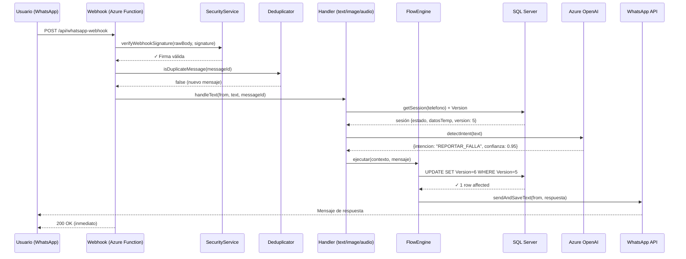
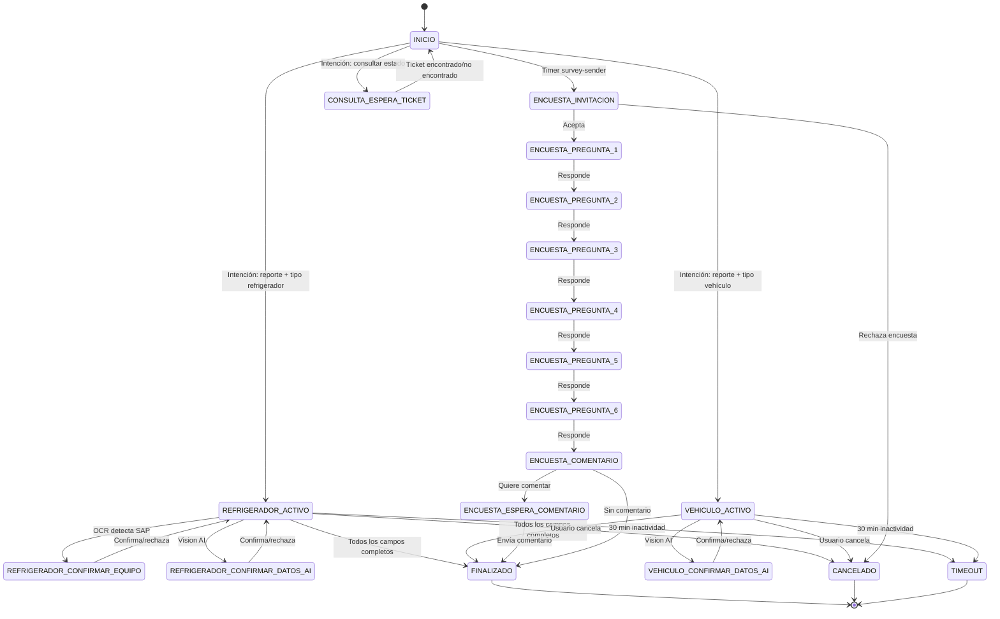
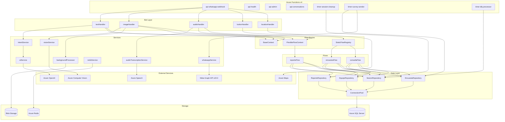

# Arquitectura — AC FIXBOT

> Audiencia: Senior Developers, Tech Leads
> Última actualización: Febrero 2026

---

## Tabla de Contenidos

1. [Flujo de Datos End-to-End](#flujo-de-datos-end-to-end)
2. [Máquina de Estados](#máquina-de-estados)
3. [FlowEngine: Static vs Flexible](#flowengine-static-vs-flexible)
4. [Sistema de Persistencia](#sistema-de-persistencia)
5. [Capas de Cache](#capas-de-cache)
6. [Deduplicación de Mensajes](#deduplicación-de-mensajes)
7. [Circuit Breaker y Retry](#circuit-breaker-y-retry)
8. [Diagramas Mermaid](#diagramas-mermaid)

---

## Flujo de Datos End-to-End

Cada mensaje de WhatsApp atraviesa la siguiente pipeline desde que llega al webhook hasta que se envía la respuesta:

```
WhatsApp (Meta) → HTTPS POST → Azure Function (api-whatsapp-webhook)
                                       │
                                       ▼
                              ┌─────────────────┐
                              │ 1. Verificación  │  HMAC-SHA256 con WHATSAPP_APP_SECRET
                              │    de firma      │  crypto.timingSafeEqual()
                              └────────┬─────────┘
                                       │
                              ┌────────▼─────────┐
                              │ 2. Deduplicación  │  Memoria (Set) + DB (MERGE atómico)
                              │                   │  MensajesProcessados.MensajeId UNIQUE
                              └────────┬──────────┘
                                       │
                              ┌────────▼──────────┐
                              │ 3. Router por tipo │
                              │    de mensaje      │
                              └────────┬──────────┘
                                       │
                    ┌──────────────────┼──────────────────┐
                    │                  │                   │
              ┌─────▼─────┐    ┌──────▼──────┐    ┌──────▼──────┐
              │   TEXTO    │    │   IMAGEN    │    │   AUDIO     │
              │textHandler │    │imageHandler │    │audioHandler │
              └─────┬──────┘    └──────┬──────┘    └──────┬──────┘
                    │                  │                   │
              ┌─────▼──────┐    ┌──────▼──────┐    ┌──────▼──────┐
              │ Cargar      │    │ Rate limit  │    │ Descargar   │
              │ sesión      │    │ (3/min,     │    │ media de    │
              │ (Version)   │    │  20/hora)   │    │ WhatsApp    │
              └─────┬──────┘    └──────┬──────┘    └──────┬──────┘
                    │                  │                   │
              ┌─────▼──────┐    ┌──────▼──────┐    ┌──────▼──────┐
              │ Detectar    │    │ OCR +       │    │ Transcribir │
              │ intención   │    │ AI Vision   │    │ (Whisper    │
              │ (3-tier)    │    │             │    │  → Speech)  │
              └─────┬──────┘    └──────┬──────┘    └──────┬──────┘
                    │                  │                   │
                    └──────────────────┼───────────────────┘
                                       │
                              ┌────────▼──────────┐
                              │ 4. Ejecutar flujo  │  FlowEngine (contexto inyectado)
                              │    conversacional  │  BaseContext / FlexibleFlowContext
                              └────────┬──────────┘
                                       │
                              ┌────────▼──────────┐
                              │ 5. Actualizar      │  UPDATE ... WHERE Version = @expected
                              │    sesión (SQL)    │  Si falla → optimistic lock error
                              └────────┬──────────┘
                                       │
                              ┌────────▼──────────┐
                              │ 6. Responder       │  Meta Graph API v22.0
                              │    a WhatsApp      │  sendAndSaveText / Interactive
                              └────────┬──────────┘
                                       │
                              ┌────────▼──────────┐
                              │ 7. Guardar mensaje │  MensajesChat (tipo U/B)
                              │    en historial    │
                              └───────────────────┘
```

**Tiempo total objetivo:** < 5 segundos por mensaje (budget del webhook de Meta).

### Respuesta HTTP

El webhook **siempre** responde `200 OK` inmediatamente, incluso si el procesamiento falla. Los errores se envían a la Dead Letter Queue para reintento posterior. Esto evita que Meta reintente el mismo mensaje (exponential backoff de hasta 24h).

---

## Máquina de Estados

Cada sesión de chat tiene un estado persistido en `SesionesChat.EstadoId`. Los estados están definidos en `bot/constants/sessionStates.js` y normalizados en la tabla `CatEstadoSesion`.

### Tabla de Estados

| ID    | Constante                         | Tipo     | Descripción                           |
| ----- | --------------------------------- | -------- | ------------------------------------- |
| 1     | `INICIO`                          | Terminal | Estado inicial / reset                |
| 2     | `CANCELADO`                       | Terminal | Usuario canceló el flujo              |
| 3     | `FINALIZADO`                      | Terminal | Flujo completado exitosamente         |
| 4     | `TIMEOUT`                         | Terminal | Sesión cerrada por inactividad        |
| 12    | `ENCUESTA_INVITACION`             | Estático | Invitación a encuesta enviada         |
| 13-18 | `ENCUESTA_PREGUNTA_1` a `_6`      | Estático | Preguntas de la encuesta (escala 1-5) |
| 19    | `ENCUESTA_COMENTARIO`             | Estático | Paso de comentario opcional           |
| 20    | `ENCUESTA_ESPERA_COMENTARIO`      | Estático | Esperando texto de comentario         |
| 21    | `CONSULTA_ESPERA_TICKET`          | Estático | Esperando número de ticket            |
| 23    | `REFRIGERADOR_ACTIVO`             | Flexible | Reporte de refrigerador en progreso   |
| 24    | `VEHICULO_ACTIVO`                 | Flexible | Reporte de vehículo en progreso       |
| 25    | `REFRIGERADOR_CONFIRMAR_EQUIPO`   | Flexible | Confirmación de equipo por OCR        |
| 26    | `VEHICULO_CONFIRMAR_DATOS_AI`     | Flexible | Confirmación de datos por Vision AI   |
| 27    | `REFRIGERADOR_CONFIRMAR_DATOS_AI` | Flexible | Confirmación de datos por Vision AI   |
| 28    | `AGENTE_ACTIVO`                   | Especial | Sesión transferida a agente humano    |

### Reglas de Transición

```
INICIO ──────────────────┬──▶ REFRIGERADOR_ACTIVO    (intención: REPORTAR_FALLA + tipo)
                         ├──▶ VEHICULO_ACTIVO         (intención: REPORTAR_FALLA + tipo)
                         ├──▶ ENCUESTA_INVITACION     (timer survey-sender)
                         └──▶ CONSULTA_ESPERA_TICKET  (intención: CONSULTAR_ESTADO)

REFRIGERADOR_ACTIVO ────┬──▶ REFRIGERADOR_CONFIRMAR_EQUIPO  (OCR detecta código SAP)
                        ├──▶ REFRIGERADOR_CONFIRMAR_DATOS_AI (Vision detecta datos)
                        └──▶ FINALIZADO                      (ticket creado)

VEHICULO_ACTIVO ────────┬──▶ VEHICULO_CONFIRMAR_DATOS_AI    (Vision detecta datos)
                        └──▶ FINALIZADO                      (ticket creado)

ENCUESTA_INVITACION ───▶ ENCUESTA_PREGUNTA_1 ──▶ ... ──▶ ENCUESTA_PREGUNTA_6
                                                              │
                                                              ▼
                                                    ENCUESTA_COMENTARIO
                                                              │
                                                              ▼
                                                         FINALIZADO

Cualquier estado ──────▶ CANCELADO    (intención: CANCELAR)
Cualquier estado ──────▶ TIMEOUT      (timer session-cleanup, 30 min inactividad)
Cualquier estado ──────▶ INICIO       (intención: DESPEDIDA o flujo completado)
```

---

## FlowEngine: Static vs Flexible

El FlowEngine implementa dos estrategias de avance según el tipo de flujo:

### BaseContext (`core/flowEngine/contexts/BaseContext.js`)

Clase base que provee operaciones comunes a todos los contextos:

```javascript
// Métodos principales
responder(texto)              // Envía texto + guarda en MensajesChat
responderConBotones(...)      // Envía mensaje interactivo con botones
responderConLista(...)        // Envía menú de lista
cambiarEstado(nuevoEstado)    // Actualiza sesión con bloqueo optimista
actualizarDatos(datos)        // Merge en DatosTemp (JSON)
finalizar()                   // Reset a INICIO + limpia DatosTemp
```

### StaticFlowContext (Encuesta, Consulta)

Los flujos estáticos avanzan **secuencialmente** por estados predefinidos. Cada estado tiene un handler específico y un único estado siguiente.

```
ENCUESTA_PREGUNTA_1 → ENCUESTA_PREGUNTA_2 → ... → ENCUESTA_COMENTARIO → FINALIZADO
```

- **Registro:** `StaticFlowRegistry.registrar(flow)` — singleton global
- **Routing:** `obtenerPorEstado(estadoId)` busca el handler del estado actual
- **Botones:** `obtenerHandlerBoton(buttonId)` para respuestas interactivas

### FlexibleFlowContext (`core/flowEngine/contexts/FlexibleFlowContext.js`)

Los flujos flexibles (refrigerador, vehículo) permiten completar campos **en cualquier orden**. El contexto mantiene una lista de campos requeridos y el usuario puede proporcionarlos de forma natural.

```javascript
// Métodos exclusivos de FlexibleFlowContext
getCamposRequeridos(); // Lista de campos para este tipo de reporte
actualizarCampo(campo, valor); // Actualiza un campo en DatosTemp
actualizarCampos(datos); // Actualización batch de múltiples campos
getCamposFaltantes(); // Campos aún no completados
todosLosCamposCompletos(); // ¿Listo para generar ticket?
```

**Ejemplo de flujo flexible:**

```
Estado: REFRIGERADOR_ACTIVO
Campos requeridos: [codigoSAP, descripcion, imagen]

 1. Usuario envía foto → OCR extrae codigoSAP → actualizarCampo('codigoSAP', '1234567')
 2. Usuario escribe "no enfría" → actualizarCampo('descripcion', 'no enfría')
 3. La foto también sirve como imagen → actualizarCampo('imagen', blobUrl)
 4. todosLosCamposCompletos() === true → crear ticket → finalizar()
```

### Diagrama de Selección de Contexto

```
Mensaje entrante
      │
      ▼
¿Estado actual en StaticFlowRegistry?
      │
    Sí ──▶ StaticFlowContext (encuesta, consulta)
      │
    No ──▶ ¿Estado es REFRIGERADOR_ACTIVO / VEHICULO_ACTIVO / *_CONFIRMAR_*?
             │
           Sí ──▶ FlexibleFlowContext (reporte)
             │
           No ──▶ Estado INICIO → Detectar intención → Crear nuevo flujo
```

---

## Sistema de Persistencia

### Bloqueo Optimista (Version++)

Con ~3,000 reportes/mes y procesamiento asíncrono (background image processing, múltiples handlers), las condiciones de carrera son un riesgo real. AC FIXBOT implementa bloqueo optimista a nivel de sesión:

```sql
-- Lectura: obtener versión actual
SELECT *, Version FROM SesionesChat WHERE Telefono = @telefono

-- Escritura: actualizar solo si la versión no cambió
UPDATE SesionesChat
SET EstadoId = @nuevoEstado,
    DatosTemp = @datos,
    Version = Version + 1,
    UltimaActividad = GETUTCDATE()
WHERE Telefono = @telefono
  AND Version = @expectedVersion    -- ← Bloqueo optimista

-- Si @@ROWCOUNT = 0 → la sesión fue modificada por otro proceso
-- El handler detecta esto y reintenta con la nueva versión
```

**¿Por qué no pessimistic locking?**

| Aspecto              | Pessimistic              | Optimistic (elegido)        |
| -------------------- | ------------------------ | --------------------------- |
| Contención           | Bloquea filas            | Sin bloqueos                |
| Deadlocks            | Posibles                 | Imposibles                  |
| Latencia             | Alta (espera lock)       | Baja (retry en conflicto)   |
| Tasa de conflicto    | Aceptable si baja        | ~3,000/mes = bajo conflicto |
| Timeout de Functions | Riesgo con 5 min timeout | Sin riesgo                  |

**Índice de soporte:**

```sql
CREATE INDEX IX_SesionesChat_Telefono_Version
ON SesionesChat(Telefono, Version);
```

### Esquema de Datos Simplificado

```
┌─────────────────┐     ┌────────────────┐     ┌────────────────┐
│  SesionesChat   │     │    Reportes     │     │    Equipos     │
│─────────────────│     │────────────────│     │────────────────│
│ Telefono (UK)   │     │ NumeroTicket   │     │ CodigoSAP (UK) │
│ EstadoId (FK)   │────▶│ TipoReporteId  │     │ CodigoBarras   │
│ DatosTemp (JSON)│     │ EstadoReporte  │◀────│ ClienteId (FK) │
│ Version (INT)   │     │ EquipoId (FK)  │────▶│ Modelo / Marca │
│ EquipoIdTemp    │     │ CentroServicio │     └────────────────┘
│ NombreUsuario   │     │ Latitud/Long   │
│ AgenteId        │     │ ImagenUrl      │     ┌────────────────┐
│ AdvertenciaEnv  │     │ FechaResolucion│     │CentrosServicio │
└─────────────────┘     └────────┬───────┘     │────────────────│
                                 │              │ Codigo (UK)    │
                        ┌────────▼───────┐     │ Latitud/Long   │
                        │   Encuestas    │     │ Horarios       │
                        │────────────────│     └────────────────┘
                        │ ReporteId (FK) │
                        │ TipoEncuestaId │     ┌────────────────┐
                        │ EstadoEncuesta │     │ DeadLetter     │
                        │ PreguntaActual │     │  Messages      │
                        │ RespuestasJSON │     │────────────────│
                        └────────┬───────┘     │ MensajeId (UK) │
                                 │              │ ErrorMensaje   │
                        ┌────────▼───────┐     │ Procesado      │
                        │ Respuestas     │     └────────────────┘
                        │  Encuesta      │
                        │────────────────│     ┌────────────────┐
                        │ PreguntaId(FK) │     │ MensajesChat   │
                        │ Respuesta(1-5) │     │────────────────│
                        │ Comentario     │     │ Telefono       │
                        └────────────────┘     │ TipoMensaje    │
                                               │   (U/B)        │
                                               │ TipoContenido  │
                                               └────────────────┘
```

### Stored Procedures Clave

| SP                                 | Propósito                                   | Usado por             |
| ---------------------------------- | ------------------------------------------- | --------------------- |
| `sp_CheckSpam`                     | Rate limiting por teléfono                  | Webhook               |
| `sp_GetSesionesNeedingWarning`     | Sesiones próximas a timeout                 | timer-session-cleanup |
| `sp_GetSesionesToClose`            | Sesiones que excedieron timeout             | timer-session-cleanup |
| `sp_GetReportesPendientesEncuesta` | Reportes resueltos sin encuesta (> 24h)     | timer-survey-sender   |
| `sp_ExpirarEncuestasSinRespuesta`  | Marcar encuestas como expiradas (> 72h)     | timer-survey-sender   |
| `sp_GetDeadLettersForRetry`        | Mensajes fallidos no procesados             | timer-dlq-processor   |
| `sp_CleanOldDeadLetters`           | Limpieza de DLQ > 30 días                   | timer-dlq-processor   |
| `sp_GetCentroServicioMasCercano`   | Haversine: centro más cercano a coordenadas | reporteFlow           |
| `sp_GetHistorialTelefono`          | Historial de conversación por teléfono      | api-conversations     |

---

## Capas de Cache

AC FIXBOT implementa un sistema de cache de 3 niveles para minimizar consultas a SQL Server:

```
┌──────────────────────────────────────────────────────┐
│                   Petición de datos                    │
└──────────────────────┬───────────────────────────────┘
                       │
              ┌────────▼─────────┐
              │  Nivel 1: Local  │  Map en memoria del proceso
              │  TTL variable    │  Max 10,000 entries + LRU eviction
              │  (0 ms latencia) │
              └────────┬─────────┘
                       │ MISS
              ┌────────▼─────────┐
              │  Nivel 2: Redis  │  Azure Cache for Redis (TLS:6380)
              │  TTL configurable│  Compartido entre instancias
              │  (~1-3 ms)       │  Prefijo: acfixbot:*
              └────────┬─────────┘
                       │ MISS o Redis deshabilitado
              ┌────────▼─────────┐
              │  Nivel 3: SQL    │  Azure SQL Server
              │  Fuente de       │  Connection pool (min:2, max:10)
              │  verdad          │  Retry con backoff exponencial
              └──────────────────┘
```

### TTLs por Tipo de Dato

| Dato                  | Cache Local     | Redis  | Justificación                        |
| --------------------- | --------------- | ------ | ------------------------------------ |
| Sesiones              | 5 min           | 5 min  | Dato caliente, cambia frecuentemente |
| Equipos (SAP)         | 15 min          | 15 min | Catálogo estable, alta lectura       |
| Intenciones (AI)      | 5 min (max 500) | 5 min  | Evitar llamadas AI repetidas         |
| Preguntas de encuesta | 30 min          | —      | Catálogo casi estático               |
| Encuestas activas     | 60 min          | —      | Evitar consultas DB durante flujo    |

### Fallback Automático

Si Redis no está disponible o `REDIS_ENABLED=false`, el sistema usa automáticamente un `Map` local con las mismas TTLs. Este fallback es transparente:

```javascript
// redisService.js
class RedisService {
  constructor() {
    this.localCache = new Map(); // Fallback siempre disponible
    this.MAX_LOCAL_ENTRIES = 10_000; // Protección de memoria
  }

  async get(key) {
    // 1. Intenta Redis
    // 2. Si falla → usa localCache
    // 3. Fire-and-forget sync
  }
}
```

### Limpieza

- **Cache local:** Cleanup automático cada 2 minutos (elimina entradas expiradas)
- **Redis:** TTL nativo (Redis expira automáticamente)
- **Protección de memoria:** Si el Map local excede 10,000 entries, aplica LRU eviction

---

## Deduplicación de Mensajes

Meta puede reenviar el mismo mensaje múltiples veces (retries, at-least-once delivery). AC FIXBOT implementa deduplicación en dos capas:

### Capa 1: Memoria (Set)

```javascript
// rateLimiter.js
const processedMessages = new Set(); // O(1) lookup

function isDuplicateMessage(messageId) {
  if (processedMessages.has(messageId)) return true;
  processedMessages.add(messageId);
  return false;
}
```

- Rápido (< 0.1ms)
- No sobrevive a reinicios de la Function App
- Por eso existe la capa 2

### Capa 2: Base de datos (MERGE atómico)

```sql
MERGE MensajesProcessados AS target
USING (SELECT @messageId AS MensajeId) AS source
ON target.MensajeId = source.MensajeId
WHEN MATCHED THEN
    UPDATE SET ContadorReintentos = ContadorReintentos + 1
WHEN NOT MATCHED THEN
    INSERT (MensajeId, Telefono, FechaProces)
    VALUES (@messageId, @telefono, GETUTCDATE());
```

- Atómico (sin race conditions entre instancias)
- Sobrevive a reinicios
- El `ContadorReintentos` permite monitorear la frecuencia de duplicados

---

## Circuit Breaker y Retry

### Circuit Breaker

Protege contra cascadas de fallos en servicios externos (WhatsApp API, OpenAI, Vision):

```
Estados del Circuit Breaker:

CLOSED ────[fallo]────▶ Incrementa contador
   │                          │
   │                    ¿> threshold?
   │                          │
   │                        Sí ──▶ OPEN ──[timeout]──▶ HALF_OPEN
   │                                 │                      │
   │                                 │               ¿Éxito en prueba?
   │                                 │                      │
   │                               Rechaza            Sí ──▶ CLOSED
   │                               peticiones          │
   │                                                 No ──▶ OPEN
   │
 Éxito ──▶ Reset contador
```

### Retry con Backoff Exponencial

```javascript
// whatsappService.js - executeWithRetry()
async function executeWithRetry(fn, maxRetries = 2) {
  for (let attempt = 0; attempt <= maxRetries; attempt++) {
    try {
      return await fn();
    } catch (error) {
      if (!isRetryable(error) || attempt === maxRetries) throw error;

      const delay = baseDelay * Math.pow(2, attempt); // 1s, 2s, 4s...
      const jitter = delay * Math.random() * 0.25; // Anti thundering herd
      await sleep(Math.min(delay + jitter, 30000)); // Max 30s
    }
  }
}

// Errores retryable:
// - Network timeouts
// - HTTP 429 (rate limit de Meta)
// - HTTP 5xx (error de servidor)
```

---

## Diagramas Mermaid

### Flujo de Datos Principal



### Diagrama de Estados



### Arquitectura de Componentes



---

## Consideraciones de Rendimiento

### Presupuesto de Latencia (5s budget del webhook)

| Operación                      | Latencia típica | Presupuesto    |
| ------------------------------ | --------------- | -------------- |
| Verificación de firma          | < 1 ms          | Fijo           |
| Deduplicación (memoria)        | < 0.1 ms        | Fijo           |
| Deduplicación (DB MERGE)       | 5-15 ms         | Variable       |
| Carga de sesión (cache hit)    | < 1 ms          | Variable       |
| Carga de sesión (cache miss)   | 10-30 ms        | Variable       |
| Detección de intención (cache) | < 0.1 ms        | —              |
| Detección de intención (regex) | < 1 ms          | —              |
| Detección de intención (AI)    | 100-500 ms      | Dominante      |
| Actualización de sesión        | 5-15 ms         | Variable       |
| Envío de respuesta WhatsApp    | 100-300 ms      | Fijo           |
| **Total típico**               | **200-800 ms**  | **< 5,000 ms** |

### Connection Pool

```javascript
// core/services/storage/connectionPool.js
pool: {
  min: 2,       // Conexiones mínimas activas
  max: 10,      // Máximo concurrent
  idleTimeoutMillis: 30000,  // 30s idle → cerrar
}
```

---

## Decisiones Arquitectónicas Clave

| Decisión                            | Alternativa descartada  | Justificación                                 |
| ----------------------------------- | ----------------------- | --------------------------------------------- |
| Bloqueo optimista (Version++)       | Pessimistic locking     | Sin deadlocks, baja contención a 3K/mes       |
| Cache local + Redis                 | Solo Redis              | Resiliencia si Redis cae, menor latencia      |
| Deduplicación dual (mem + DB)       | Solo DB                 | Performance en hot path + durabilidad         |
| FlowEngine dual (Static + Flexible) | Un solo tipo            | Encuestas son secuenciales, reportes no       |
| Dead Letter Queue en SQL            | Azure Service Bus       | Menor complejidad, suficiente para el volumen |
| 200 OK inmediato en webhook         | Procesamiento síncrono  | Evita retries de Meta                         |
| Respuesta dentro de Function        | Queue + worker separado | Menor latencia, arquitectura más simple       |
