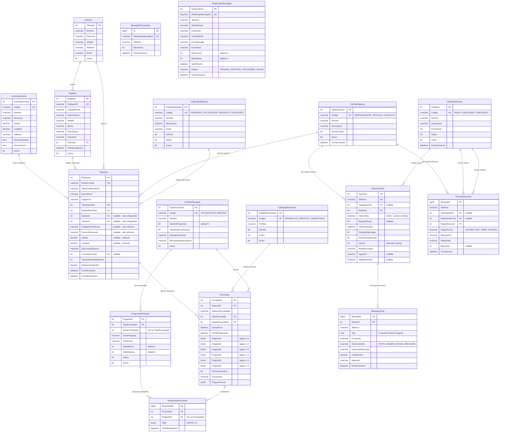

# Diagrama Entidad-Relacion (ERD)

```mermaid
erDiagram
    %% ====== CATALOGOS ======
    CatTipoReporte {
        int TipoReporteId PK
        nvarchar Codigo UK "REFRIGERADOR, VEHICULO, CONSULTA"
        nvarchar Nombre
        nvarchar Descripcion
        bit GeneraTicket
        bit Activo
        datetime FechaCreacion
    }

    CatEstadoSesion {
        int EstadoId PK
        nvarchar Codigo UK "INICIO, CANCELADO, FINALIZADO..."
        nvarchar Nombre
        nvarchar Descripcion
        bit EsTerminal
        int Orden
        bit Activo
        datetime FechaCreacion
    }

    CatEstadoReporte {
        int EstadoReporteId PK
        nvarchar Codigo UK "PENDIENTE, EN_PROCESO, RESUELTO, CANCELADO"
        nvarchar Nombre
        nvarchar Descripcion
        nvarchar Emoji
        bit EsFinal
        int Orden
        bit Activo
    }

    CatEstadoEncuesta {
        int EstadoEncuestaId PK
        nvarchar Codigo UK "ENVIADA, EN_PROCESO, COMPLETADA..."
        nvarchar Nombre
        bit EsFinal
        int Orden
        bit Activo
    }

    CatTipoEncuesta {
        int TipoEncuestaId PK
        nvarchar Codigo UK "SATISFACCION_SERVICIO"
        nvarchar Nombre
        int NumeroPreguntas "default 6"
        bit TienePasoComentario
        nvarchar MensajeInvitacion
        nvarchar MensajeAgradecimiento
        bit Activo
    }

    PreguntasEncuesta {
        int PreguntaId PK
        int TipoEncuestaId FK
        int NumeroPregunta "UK con TipoEncuestaId"
        nvarchar TextoPregunta
        nvarchar TextoCorto
        int ValorMinimo "default 1"
        int ValorMaximo "default 5"
        int Orden
        bit Activo
    }

    %% ====== NEGOCIO ======
    Clientes {
        int ClienteId PK
        nvarchar Nombre
        nvarchar Direccion
        nvarchar Ciudad
        nvarchar Telefono
        nvarchar Email
        bit Activo
    }

    Equipos {
        int EquipoId PK
        nvarchar CodigoSAP UK
        nvarchar CodigoBarras
        nvarchar NumeroSerie
        nvarchar Modelo
        nvarchar Marca
        nvarchar Descripcion
        nvarchar Ubicacion
        int ClienteId FK
        datetime FechaInstalacion
        bit Activo
    }

    CentrosServicio {
        int CentroServicioId PK
        nvarchar Codigo UK
        nvarchar Nombre
        nvarchar Direccion
        decimal Latitud
        decimal Longitud
        nvarchar Telefono
        time HorarioApertura
        time HorarioCierre
        bit Activo
    }

    Reportes {
        int ReporteId PK
        nvarchar NumeroTicket UK
        nvarchar TelefonoReportante
        nvarchar Descripcion
        nvarchar ImagenUrl
        int TipoReporteId FK
        int EstadoReporteId FK
        int EquipoId FK "nullable - solo refrigerador"
        int ClienteId FK "nullable - solo refrigerador"
        nvarchar CodigoSAPVehiculo "nullable - solo vehiculo"
        nvarchar NumeroEmpleado "nullable - solo vehiculo"
        decimal Latitud "nullable - vehiculo"
        decimal Longitud "nullable - vehiculo"
        nvarchar DireccionUbicacion
        int CentroServicioId FK "nullable"
        int TiempoEstimadoMinutos
        decimal DistanciaCentroKm
        datetime FechaCreacion
        datetime FechaResolucion
    }

    Encuestas {
        int EncuestaId PK
        int ReporteId FK
        nvarchar TelefonoEncuestado
        int TipoEncuestaId FK
        int EstadoEncuestaId FK
        datetime FechaEnvio
        datetime FechaFinalizacion
        tinyint Pregunta1 "legacy 1-5"
        tinyint Pregunta2 "legacy 1-5"
        tinyint Pregunta3 "legacy 1-5"
        tinyint Pregunta4 "legacy 1-5"
        tinyint Pregunta5 "legacy 1-5"
        tinyint Pregunta6 "legacy 1-5"
        bit TieneComentario
        nvarchar Comentario
        tinyint PreguntaActual
    }

    RespuestasEncuesta {
        bigint RespuestaId PK
        int EncuestaId FK
        int PreguntaId FK "UK con EncuestaId"
        tinyint Valor "CHECK 1-5"
        datetime FechaRespuesta
    }

    %% ====== SESION / OPERACIONAL ======
    SesionesChat {
        int SesionId PK
        nvarchar Telefono UK
        int TipoReporteId FK "nullable"
        int EstadoId FK
        nvarchar DatosTemp "JSON - campos del flujo"
        int EquipoIdTemp "nullable"
        datetime UltimaActividad
        int ContadorMensajes
        bit AdvertenciaEnviada
        int Version "optimistic locking"
        nvarchar NombreUsuario
        nvarchar AgenteId "nullable"
        nvarchar AgenteNombre "nullable"
    }

    HistorialSesiones {
        bigint HistorialId PK
        nvarchar Telefono
        int TipoReporteId FK "nullable"
        int EstadoAnteriorId FK "nullable"
        int EstadoNuevoId FK
        nvarchar OrigenAccion "USUARIO, BOT, TIMER, SISTEMA"
        nvarchar Descripcion
        nvarchar DatosExtra
        int ReporteId "nullable"
        datetime FechaAccion
    }

    MensajesChat {
        bigint MensajeId PK
        int SesionId FK
        nvarchar Telefono
        char Tipo "U=usuario B=bot A=agente"
        nvarchar Contenido
        nvarchar TipoContenido "TEXTO, IMAGEN, BOTON, UBICACION"
        nvarchar IntencionDetectada
        decimal ConfianzaIA
        nvarchar AgenteId
        datetime FechaCreacion
    }

    MensajesProcesados {
        bigint Id PK
        nvarchar WhatsAppMessageId UK
        nvarchar Telefono
        int Reintentos
        datetime FechaCreacion
    }

    DeadLetterMessages {
        int DeadLetterId PK
        nvarchar WhatsAppMessageId UK
        nvarchar Telefono
        nvarchar TipoMensaje
        nvarchar Contenido
        nvarchar CorrelationId
        nvarchar ErrorMessage
        nvarchar ErrorStack
        int RetryCount "default 0"
        int MaxRetries "default 3"
        datetime NextRetryAt
        nvarchar Estado "PENDING, RETRYING, PROCESSED, FAILED"
        datetime FechaCreacion
    }

    %% ====== RELACIONES ======
    CatTipoEncuesta ||--o{ PreguntasEncuesta : "tiene preguntas"
    CatTipoEncuesta ||--o{ Encuestas : "tipo de"

    CatEstadoSesion ||--o{ SesionesChat : "estado actual"
    CatEstadoSesion ||--o{ HistorialSesiones : "estado anterior"
    CatEstadoSesion ||--o{ HistorialSesiones : "estado nuevo"

    CatEstadoReporte ||--o{ Reportes : "estado del reporte"
    CatEstadoEncuesta ||--o{ Encuestas : "estado encuesta"
    CatTipoReporte ||--o{ Reportes : "tipo de reporte"
    CatTipoReporte ||--o{ SesionesChat : "tipo reporte sesion"
    CatTipoReporte ||--o{ HistorialSesiones : "tipo reporte historial"

    Clientes ||--o{ Equipos : "posee"
    Clientes ||--o{ Reportes : "reporta"

    Equipos ||--o{ Reportes : "equipo reportado"
    CentrosServicio ||--o{ Reportes : "centro asignado"

    Reportes ||--o{ Encuestas : "genera encuesta"
    Encuestas ||--o{ RespuestasEncuesta : "respuestas"
    PreguntasEncuesta ||--o{ RespuestasEncuesta : "pregunta respondida"

    SesionesChat ||--o{ MensajesChat : "mensajes de sesion"
```
