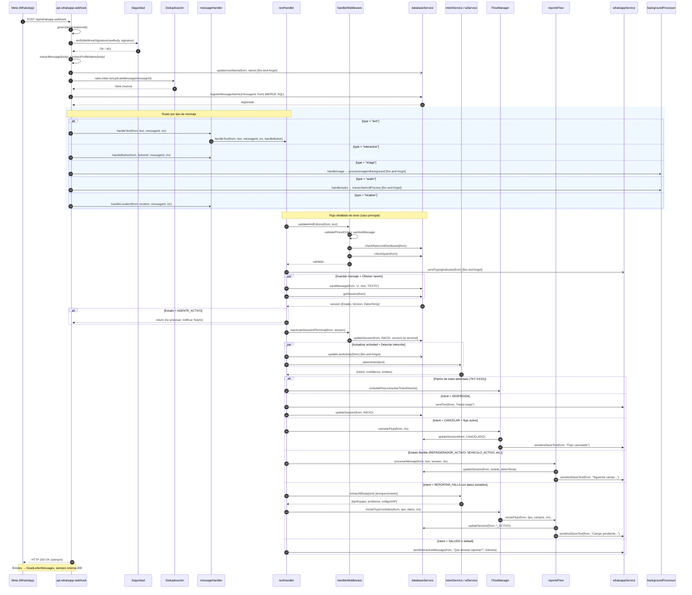

# Diagrama de Secuencia: Webhook Meta → Respuesta

```mermaid
sequenceDiagram
    autonumber
    participant Meta as Meta (WhatsApp)
    participant WH as api-whatsapp-webhook
    participant Sec as Seguridad
    participant Dedup as Deduplicación
    participant MH as messageHandler
    participant TH as textHandler
    participant MW as handlerMiddleware
    participant DB as databaseService
    participant AI as intentService / aiService
    participant FM as FlowManager
    participant RF as reporteFlow
    participant WA as whatsappService
    participant BG as backgroundProcessor

    Meta->>+WH: POST /api/whatsapp-webhook
    WH->>WH: generateCorrelationId()
    WH->>Sec: verifyWebhookSignature(rawBody, signature)
    Sec-->>WH: OK / 401

    WH->>WH: extractMessage(body) + extractProfileName(body)
    WH-)DB: updateUserName(from, name) [fire-and-forget]

    WH->>Dedup: rateLimiter.isDuplicateMessage(messageId)
    Dedup-->>WH: false (nuevo)
    WH->>DB: registerMessageAtomic(messageId, from) [MERGE SQL]
    DB-->>WH: registrado

    rect rgb(240, 248, 255)
        Note over WH,TH: Ruteo por tipo de mensaje
        alt type = "text"
            WH->>MH: handleText(from, text, messageId, ctx)
            MH->>TH: handleText(from, text, messageId, ctx, handleButton)
        else type = "interactive"
            WH->>MH: handleButton(from, buttonId, messageId, ctx)
        else type = "image"
            WH->>BG: handleImage → processImageInBackground [fire-and-forget]
        else type = "audio"
            WH->>BG: handleAudio → transcribeAndProcess [fire-and-forget]
        else type = "location"
            WH->>MH: handleLocation(from, location, messageId, ctx)
        end
    end

    Note over TH,DB: Flujo detallado de texto (caso principal)

    TH->>MW: validateAndEnforce(from, text)
    MW->>MW: validatePhoneE164 + sanitizeMessage
    MW->>DB: checkRateLimitDistributed(from)
    MW->>DB: checkSpam(from)
    MW-->>TH: validado

    TH-)WA: sendTypingIndicator(from) [fire-and-forget]

    par Guardar mensaje + Obtener sesión
        TH->>DB: saveMessage(from, 'U', text, 'TEXTO')
        TH->>DB: getSession(from)
    end
    DB-->>TH: session {Estado, Version, DatosTemp}

    alt Estado = AGENTE_ACTIVO
        TH-->>WH: return (no procesar, notificar Teams)
    end

    TH->>MW: reactivateSessionIfTerminal(from, session)
    MW->>DB: updateSession(from, INICIO, version) [si terminal]

    par Actualizar actividad + Detectar intención
        TH-)DB: updateLastActivity(from) [fire-and-forget]
        TH->>AI: detectIntent(text)
    end
    AI-->>TH: {intent, confidence, entities}

    alt Patrón de ticket detectado (TKT-XXXX)
        TH->>FM: consultaFlow.consultarTicketDirecto()
    else intent = DESPEDIDA
        TH->>WA: sendText(from, "Hasta luego")
        TH->>DB: updateSession(from, INICIO)
    else intent = CANCELAR + flujo activo
        TH->>FM: cancelarFlujo(from, ctx)
        FM->>DB: updateSession(from, CANCELADO)
        FM->>WA: sendAndSaveText(from, "Flujo cancelado")
    else Estado flexible (REFRIGERADOR_ACTIVO, VEHICULO_ACTIVO, etc.)
        TH->>RF: procesarMensaje(from, text, session, ctx)
        RF->>DB: updateSession(from, estado, datosTemp)
        RF->>WA: sendAndSaveText(from, "Siguiente campo...")
    else intent = REPORTAR_FALLA con datos extraídos
        TH->>AI: extractAllData(text) [enriquecimiento]
        AI-->>TH: {tipoEquipo, problema, codigoSAP}
        TH->>FM: iniciarFlujoConDatos(from, tipo, datos, ctx)
        FM->>RF: iniciarFlujo(from, tipo, campos, ctx)
        RF->>DB: updateSession(from, *_ACTIVO)
        RF->>WA: sendAndSaveText(from, "Campo pendiente...")
    else intent = SALUDO o default
        TH->>WA: sendInteractiveMessage(from, "Que deseas reportar?", botones)
    end

    WH-->>Meta: HTTP 200 OK (siempre)

    Note over WH,Meta: Errores → DeadLetterMessages, siempre retorna 200
```
