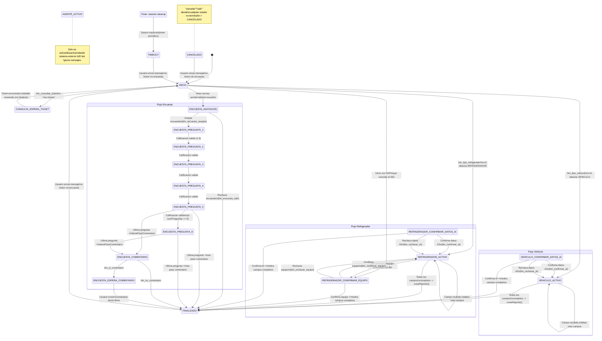

# Diagrama de Maquina de Estados: Sesiones del Bot

```mermaid
stateDiagram-v2
    classDef terminal fill:#f9f,stroke:#333,stroke-width:2px
    classDef flexible fill:#bbf,stroke:#333,stroke-width:2px
    classDef encuesta fill:#bfb,stroke:#333,stroke-width:2px
    classDef consulta fill:#fbf,stroke:#333,stroke-width:2px
    classDef agente fill:#fbb,stroke:#333,stroke-width:2px

    %% === ESTADOS TERMINALES ===
    [*] --> INICIO
    INICIO:::terminal

    CANCELADO:::terminal
    FINALIZADO:::terminal
    TIMEOUT:::terminal

    %% === REACTIVACION DESDE TERMINALES ===
    CANCELADO --> INICIO : Usuario envia mensaje\no boton no-encuesta
    FINALIZADO --> INICIO : Usuario envia mensaje\no boton no-encuesta
    TIMEOUT --> INICIO : Usuario envia mensaje\no boton no-encuesta

    %% === TIMEOUT GLOBAL ===
    state "Timer: session-cleanup" as timer_timeout
    timer_timeout --> TIMEOUT : Sesion inactiva\n(timer periodico)

    %% === DESDE INICIO ===
    INICIO --> REFRIGERADOR_ACTIVO : btn_tipo_refrigerador\no AI detecta REFRIGERADOR
    INICIO --> VEHICULO_ACTIVO : btn_tipo_vehiculo\no AI detecta VEHICULO
    INICIO --> REFRIGERADOR_CONFIRMAR_EQUIPO : Inicio con SAP\nque coincide en BD
    INICIO --> CONSULTA_ESPERA_TICKET : btn_consultar_ticket\no "mis tickets"
    INICIO --> ENCUESTA_INVITACION : timer-survey-sender\n(ticket resuelto)

    %% === FLUJO REFRIGERADOR ===
    state "Flujo Refrigerador" as refri {
        REFRIGERADOR_ACTIVO:::flexible
        REFRIGERADOR_CONFIRMAR_EQUIPO:::flexible
        REFRIGERADOR_CONFIRMAR_DATOS_AI:::flexible

        REFRIGERADOR_ACTIVO --> REFRIGERADOR_ACTIVO : Campo recibido,\nfaltan mas campos
        REFRIGERADOR_ACTIVO --> REFRIGERADOR_CONFIRMAR_EQUIPO : SAP enviado,\nequipo encontrado en BD
        REFRIGERADOR_CONFIRMAR_EQUIPO --> REFRIGERADOR_ACTIVO : Confirma equipo\n(btn_confirmar_equipo)
        REFRIGERADOR_CONFIRMAR_EQUIPO --> REFRIGERADOR_ACTIVO : Rechaza equipo\n(btn_rechazar_equipo)
        REFRIGERADOR_CONFIRMAR_DATOS_AI --> REFRIGERADOR_ACTIVO : Confirma datos AI\n(btn_confirmar_ai)
        REFRIGERADOR_CONFIRMAR_DATOS_AI --> REFRIGERADOR_ACTIVO : Rechaza datos AI\n(btn_rechazar_ai)
    }
    REFRIGERADOR_ACTIVO --> FINALIZADO : Todos los campos\ncompletos -> crearReporte()
    REFRIGERADOR_CONFIRMAR_EQUIPO --> FINALIZADO : Confirma equipo +\ntodos campos completos
    REFRIGERADOR_CONFIRMAR_DATOS_AI --> FINALIZADO : Confirma AI +\ntodos campos completos

    %% === FLUJO VEHICULO ===
    state "Flujo Vehiculo" as vehi {
        VEHICULO_ACTIVO:::flexible
        VEHICULO_CONFIRMAR_DATOS_AI:::flexible

        VEHICULO_ACTIVO --> VEHICULO_ACTIVO : Campo recibido,\nfaltan mas campos
        VEHICULO_CONFIRMAR_DATOS_AI --> VEHICULO_ACTIVO : Confirma datos AI\n(btn_confirmar_ai)
        VEHICULO_CONFIRMAR_DATOS_AI --> VEHICULO_ACTIVO : Rechaza datos AI\n(btn_rechazar_ai)
    }
    VEHICULO_ACTIVO --> FINALIZADO : Todos los campos\ncompletos -> crearReporte()
    VEHICULO_CONFIRMAR_DATOS_AI --> FINALIZADO : Confirma AI +\ntodos campos completos

    %% === FLUJO ENCUESTA ===
    state "Flujo Encuesta" as enc {
        ENCUESTA_INVITACION:::encuesta
        ENCUESTA_PREGUNTA_1:::encuesta
        ENCUESTA_PREGUNTA_2:::encuesta
        ENCUESTA_PREGUNTA_3:::encuesta
        ENCUESTA_PREGUNTA_4:::encuesta
        ENCUESTA_PREGUNTA_5:::encuesta
        ENCUESTA_PREGUNTA_6:::encuesta
        ENCUESTA_COMENTARIO:::encuesta
        ENCUESTA_ESPERA_COMENTARIO:::encuesta

        ENCUESTA_INVITACION --> ENCUESTA_PREGUNTA_1 : Acepta encuesta\n(btn_encuesta_aceptar)
        ENCUESTA_PREGUNTA_1 --> ENCUESTA_PREGUNTA_2 : Calificacion valida (1-5)
        ENCUESTA_PREGUNTA_2 --> ENCUESTA_PREGUNTA_3 : Calificacion valida
        ENCUESTA_PREGUNTA_3 --> ENCUESTA_PREGUNTA_4 : Calificacion valida
        ENCUESTA_PREGUNTA_4 --> ENCUESTA_PREGUNTA_5 : Calificacion valida
        ENCUESTA_PREGUNTA_5 --> ENCUESTA_PREGUNTA_6 : Calificacion valida\n(si numPreguntas >= 6)
        ENCUESTA_PREGUNTA_5 --> ENCUESTA_COMENTARIO : Ultima pregunta +\ntienePasoComentario
        ENCUESTA_PREGUNTA_6 --> ENCUESTA_COMENTARIO : Ultima pregunta +\ntienePasoComentario
        ENCUESTA_COMENTARIO --> ENCUESTA_ESPERA_COMENTARIO : btn_si_comentario
    }
    ENCUESTA_INVITACION --> FINALIZADO : Rechaza encuesta\n(btn_encuesta_salir)
    ENCUESTA_PREGUNTA_5 --> FINALIZADO : Ultima pregunta +\nsin paso comentario
    ENCUESTA_PREGUNTA_6 --> FINALIZADO : Ultima pregunta +\nsin paso comentario
    ENCUESTA_COMENTARIO --> FINALIZADO : btn_no_comentario
    ENCUESTA_ESPERA_COMENTARIO --> FINALIZADO : Usuario envia\ncomentario (texto libre)

    %% === FLUJO CONSULTA ===
    CONSULTA_ESPERA_TICKET:::consulta
    CONSULTA_ESPERA_TICKET --> INICIO : Ticket encontrado,\ndetalle mostrado (ctx.finalizar)

    %% === AGENTE ===
    AGENTE_ACTIVO:::agente
    note right of AGENTE_ACTIVO : Solo se activa/desactiva\ndesde sistema externo.\nEl bot ignora mensajes.

    %% === CANCELACION GLOBAL ===
    note left of CANCELADO : "cancelar"/"salir" desde\ncualquier estado no-terminal\n-> CANCELADO
```
