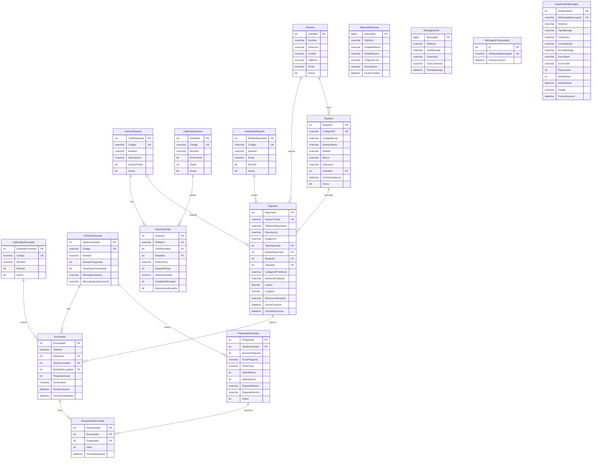

# AC FixBot - Diagrama ER de Base de Datos

## Descripcion General

La base de datos `db-acfixbot` soporta el sistema de reportes de fallas via WhatsApp.
Incluye gestion de sesiones, reportes de equipos/vehiculos, encuestas de satisfaccion y
sistema de Dead Letter Queue para mensajes fallidos.

## Diagrama Entidad-Relacion



## Tablas por Categoria

### Catalogos (Lookup Tables)

| Tabla | Descripcion | Registros Tipicos |
|-------|-------------|-------------------|
| CatTipoReporte | Tipos: REFRIGERADOR, VEHICULO, CONSULTA | 3 |
| CatEstadoSesion | 21 estados del flujo conversacional | 21 |
| CatEstadoReporte | Estados: PENDIENTE, EN_PROCESO, RESUELTO, CANCELADO | 4 |
| CatEstadoEncuesta | Estados: PENDIENTE, EN_PROCESO, COMPLETADA, EXPIRADA | 4 |
| CatTipoEncuesta | Tipos de encuesta configurables | 1 |
| PreguntasEncuesta | Preguntas por tipo de encuesta | 6 |

### Entidades de Negocio

| Tabla | Descripcion | Crecimiento |
|-------|-------------|-------------|
| Clientes | Clientes con equipos instalados | Bajo |
| Equipos | Refrigeradores con codigo SAP | Bajo |
| Reportes | Tickets de falla (100/dia estimado) | Alto |
| SesionesChat | Una por telefono activo | Medio |
| HistorialSesiones | Cambios de estado por sesion | Alto |
| MensajesChat | Mensajes del chat (10/reporte) | Muy Alto |

### Encuestas de Satisfaccion

| Tabla | Descripcion | Crecimiento |
|-------|-------------|-------------|
| Encuestas | Una por reporte resuelto | Alto |
| RespuestasEncuesta | 6 respuestas por encuesta | Alto |

### Infraestructura

| Tabla | Descripcion | Limpieza |
|-------|-------------|----------|
| MensajesProcessados | Deduplicacion de webhooks | 24 horas |
| DeadLetterMessages | Mensajes fallidos para reintento | 7 dias |

## Indices de Optimizacion

### Indices Principales

```sql
-- Busqueda rapida de equipos
IX_Equipos_CodigoSAP

-- Sesiones por estado y actividad
IX_SesionesChat_UltimaActividad_Estado

-- Reportes por ticket y fecha
IX_Reportes_NumeroTicket
IX_Reportes_FechaCreacion

-- Encuestas pendientes
IX_Reportes_FechaResolucion (filtered)
```

### Indices para Dead Letter Queue

```sql
-- Mensajes pendientes de reintento
IX_DeadLetter_PendingRetry (filtered: Estado IN PENDING, RETRYING)

-- Analisis por telefono
IX_DeadLetter_Telefono

-- Limpieza de mensajes antiguos
IX_DeadLetter_Cleanup (filtered: Estado IN PROCESSED, FAILED)
```

## Estados del Flujo Conversacional

```
INICIO
  ├── SELECCION_TIPO
  │     ├── ESPERANDO_CODIGO (Refrigerador)
  │     │     ├── CONFIRMACION_EQUIPO
  │     │     │     └── DESCRIPCION_FALLA
  │     │     │           └── CONFIRMACION_REPORTE
  │     │     │                 └── FINALIZADO
  │     │     └── EQUIPO_NO_ENCONTRADO
  │     │
  │     ├── VEHICULO_* (Flujo vehiculos)
  │     │     ├── VEHICULO_ESPERA_CODIGO
  │     │     ├── VEHICULO_ESPERA_EMPLEADO
  │     │     ├── VEHICULO_ESPERA_UBICACION
  │     │     ├── VEHICULO_DESCRIPCION
  │     │     └── VEHICULO_CONFIRMACION
  │     │
  │     └── ENCUESTA_* (Flujo encuestas)
  │           ├── ENCUESTA_PREGUNTA_1..6
  │           ├── ENCUESTA_COMENTARIO
  │           └── ENCUESTA_COMPLETADA
  │
  ├── TIMEOUT (Terminal)
  └── CANCELADO (Terminal)
```

## Stored Procedures

| Procedimiento | Descripcion |
|---------------|-------------|
| sp_CheckSpam | Detecta spam por telefono |
| sp_GetHistorialTelefono | Historial de un usuario |
| sp_GetMetricasSesiones | Metricas para dashboard |
| sp_GetSesionesNeedingWarning | Sesiones a advertir |
| sp_GetSesionesToClose | Sesiones a cerrar por timeout |
| sp_GetEstadisticasReportes | Stats de reportes |
| sp_GetReportesPendientesEncuesta | Reportes sin encuesta |
| sp_GetEstadisticasEncuestas | Stats de encuestas |
| sp_ExpirarEncuestasSinRespuesta | Expirar encuestas viejas |
| sp_GetDeadLettersForRetry | Mensajes para reintentar |
| sp_CleanOldDeadLetters | Limpieza de dead letters |

## Vistas

| Vista | Descripcion |
|-------|-------------|
| vw_SesionesActivas | Sesiones no terminales |
| vw_Reportes | Reportes con datos relacionados |
| vw_Encuestas | Encuestas con tipo y estado |
| vw_RespuestasEncuesta | Respuestas con texto de pregunta |
